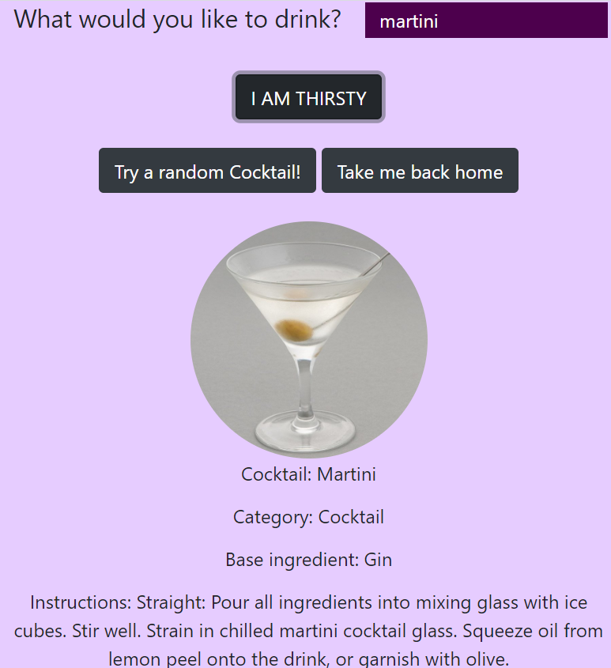
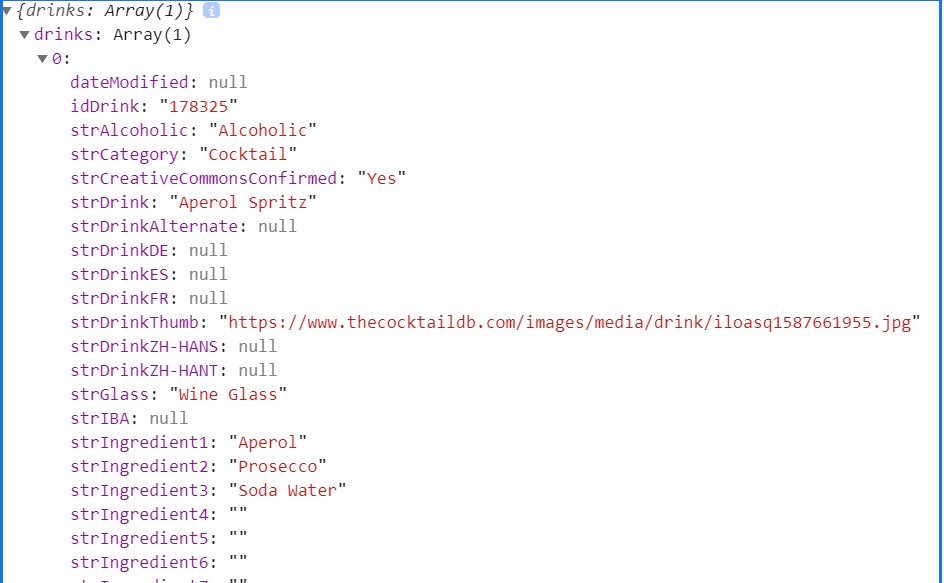
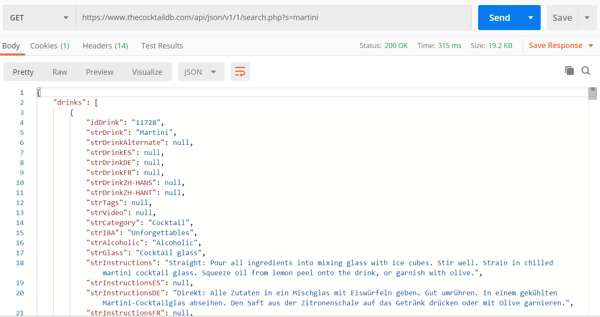
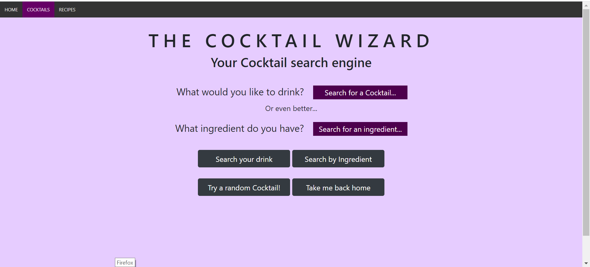
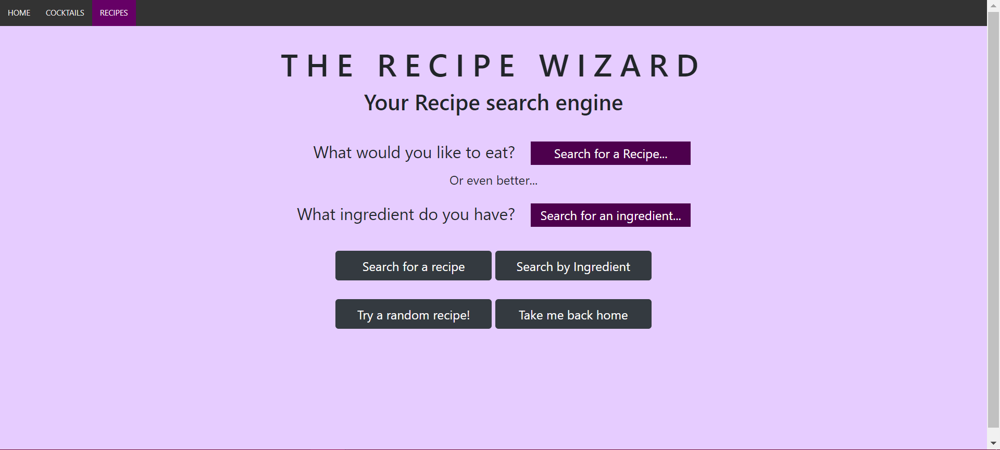
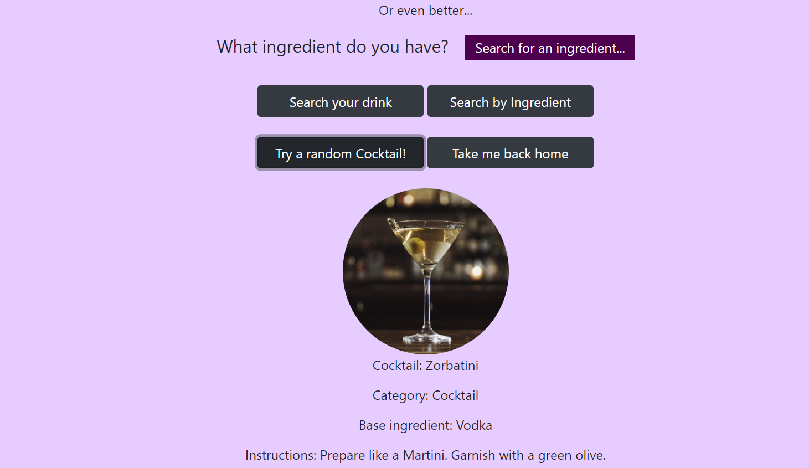
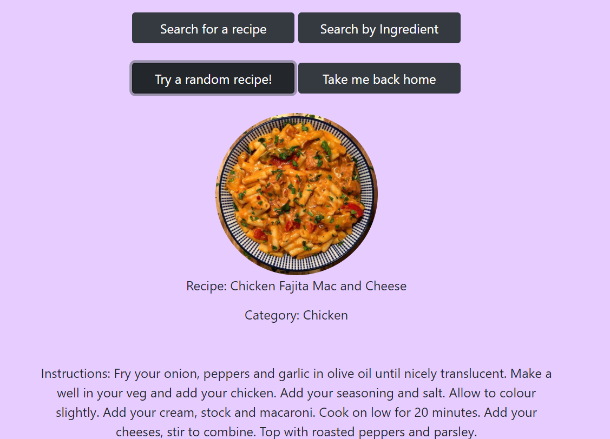
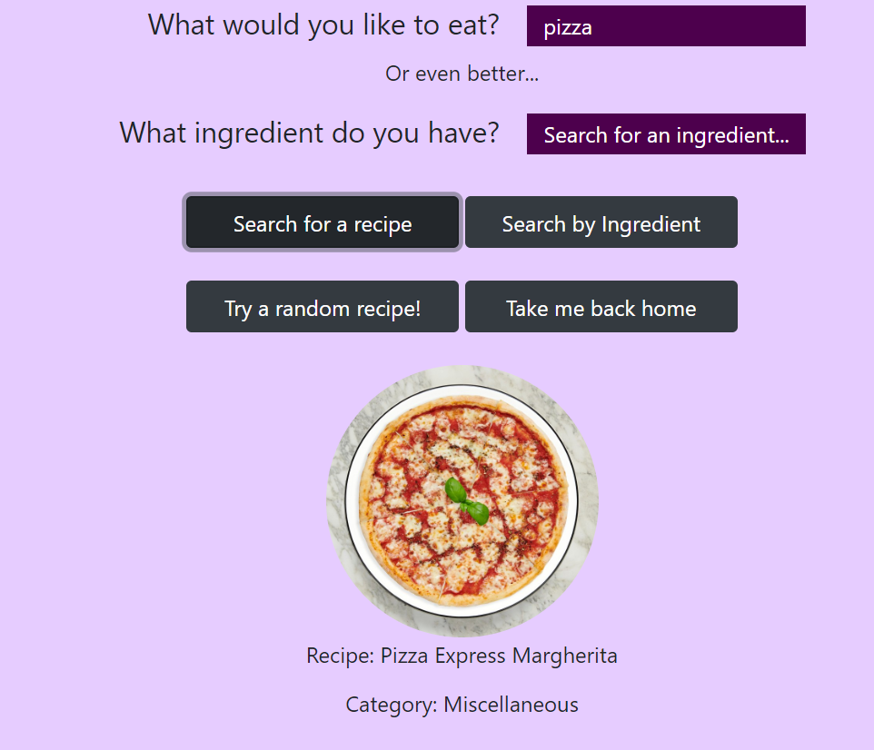
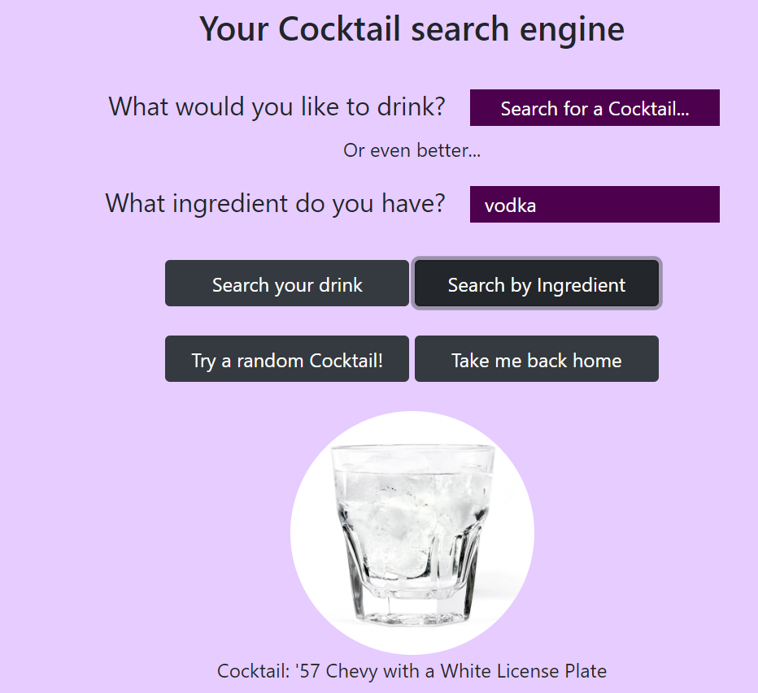
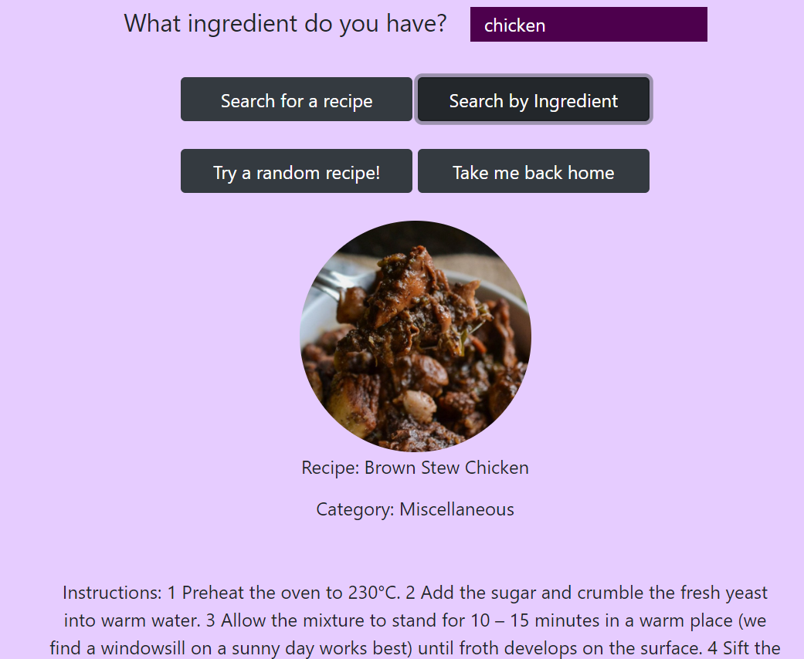

# The Cocktail & Recipes Wizard
#### Your search engine when you are in need of a quick drink or recipe.

S-au inchis restaurantele si barurile tale preferate? Nici o problema! The Cocktail & Recipes Wizard iti aduce rasfatul in propria ta casa. Venim in ajutorul celor care se simt
lipsiti de inspiratie, insa vor sa incerce ceva nou, fie ca 
este vorba de un Cocktail racoritor, fie de o reteta delicioasa si usoara. Imbinand armonios doua baze de date complexe, aplicatia pune la dispozitia utilizatorilor un mediu 
prietenos si facil de cautare si de satisfacere a poftelor. 
Ce mai stai? Cu un simplu click poti sa gasesti orice iti face pofta sau poti incerca ceva cu totul nou!

## Descriere problema

Nu e o noutate faptul ca ultimele luni ne-au pus la incercare pe majoritatea dintre noi. 
Intr-o perioada in care toate localurile si magazinele au fost inchise, chiar si cei care nu erau obisnuiti cu acest lucru, au fost pusi in situatia de a-si gati singuri. Oricat de multe servicii de livrare la domiciliu ne-ar sta la dispozitie, devine dificil de mentinut un astfel de stil de viata, din punct de vedere material. Si pentru ca nevoia te indeamna sa incerci, punem la dispozitia uilizatorilor locul perfect unde pot cauta o multitudine de retete favorite, si chiar, de ce nu, sa descopere unele cu totul noi. Si pentru ca ne este dor sa iesim cu prietenii, de ce sa nu ne facem propriile Cocktailuri acasa? The Cocktail Wizard va inspira garantat pe oricine. 

## Tehnologii utilizate
Aplicatia a fost dezvoltata pe baza urmatoarelor tehnologii:

- NodeJS
- JavaScript
- HTML
- CSS

---

## Prezentare API-uri utilizate
Aplicatia **The Cocktail & Recipe Wizard** integreaza in cadrul ei doua servicii de tip API REST, dupa cum urmeaza:

###### THE COCKTAIL DB

The Cocktail DB constituite o baza de date deschisa care, de asemenea, ofera si un serviciu de tip API pentru orice dezvoltator care doreste sa il integreze in cadrul aplicatiilor sale. Baza de date contine un numar total de 595 de bauturi, 475 de ingrediente si 595 de imagini.

 

###### THE MEAL DB

The Meal DB pune la dispozitia dezvoltatorilor o baza de date open-source, oferind si posibilitatea integrarii de API REST. In ceea ce priveste baza de date, ea este constituita din 236 de retete, 563 de ingrediente si 235 de imagini asociate.


##### Caracteristici

Atat The Cocktail DB API cat si The Meal DB API permit o serie de metode ce pot fi utilizate in mod gratuit, dar si variante suplimentare oferite doar celor care obtin un API KEY prin intermediul unui cont realizat in parteneriat cu cei de la **Patreon**. Desigur, acest cont nu este unul gratis, cea mai low-cost versiune fiind cea de "suporter" al site-ului, in valoare de 2$. 
Printre optiunile gratuite ale cele doua API-uri se enumera:
- Cautarea dupa nume;
- Cautarea dupa prima litera;
- Cautare ingredient dupa nume;
- Cautare cocktail/reteta aleatoriu/e;
- Diverse filtre;
- Imagini.
---

### Ce vei avea nevoie?
* Un mediul de lucru integrat (IDE) sau un editor text
* NodeJS versiunea >= 8.9


#### 1. Pentru a descărca codul sursă:

```bash
git clone https://github.com/ClaudiaaV/democloud.nodejs.git
```

#### 2. Pachete necesare:
```bash
npm install --save express
```

#### 3. Cum inițializez aplicatia?
```bash
cd democloud.nodejs
```
```bash
npm install
```
---
```bash
node index.js
```
Sau:
```bash
npx nodemon index.js
```

## Descriere Flux de Date
 
Fluxul de date al aplicatiei este unul destul de simplu. Avand in vedere ca se folosesc cele doua API-uri integrate, datele sunt extrase din cadrul celor doua baze de date puse la dispozitie, fara a fi necesara crearea uneia proprii. 
Accesul la fiecare baza de date se face prin intermediul unei cai de acces pusa la dispozitie de dezoltatorii API. 
- Exemplificare cai acces:
  - The Cocktail DB: `https://www.thecocktaildb.com/api/json/v1/1/search.php?s=margarita`
  - The Meal DB: `https://www.themealdb.com/api/json/v1/1/search.php?s=Arrabiata`
---
#### *Flux:*
- Utilizatorul introduce de la tastatura, intr-o zona de input, ceea ce doreste sa caute:


- Inputul este preluat sub forma de parametru si transmis catre baza de date prin intermediul uneia dintre caile de acces;
  - exemplu: ```json const api = `https://www.thecocktaildb.com/api/json/v1/1/search.php?s=${nameCocktail}` ```
- Datele sunt extrase prin intermediul unei metode **http** de tip **FETCH**, aceasta urmand sa fie detaliata mai jos;
- Raspunsul primit de catre functia *fetch* va putea fi vizibil in consola, iar pe ecran se va afisa utilizatorului rezultatul cautarii sale;

  
  
- Utilizatorii mai au pusa la dispozitie o varianta, in cazul in care nu vor sa introduca ei un anumit input. Aceasta varianta le ofera posibilitatea obtinerii unui rezultat random, intamplator. Acest rezultat poate fi, in functie de sectiunea accesata, fie un cocktail, fie o reteta.
  
  

---
## Metode HTTP utilizate
#### GET

Principala metoda utilizata in cadrul aplicatiei este cea de GET. 
Aceasta este utilizată pentru a prelua informații de pe serverul dat folosind un **URL** . Cererile care utilizează GET ar trebui doar să recupereze datele, fara să aibă niciun alt efect asupra lor.
De aceea, metoda *GET* este considerata a fi cea mai sigura metoda dintre cele HTTP.
 - ##### `FETCH()`
 
Functia `Fetch()`este foarte des utilizata in cazul serviciilor de tip API. Folosind una dintre metodele HTTP (GET, POST, PUT, DELETE),
functia implementata in JavaScript, ofera o metoda facila si logica de a accesa resurse dintr-o anumita retea, totul in mod asincron. 
Singurul argument mandatory al `fetch()` este **URL-ul** sursei pe care dorim sa o accesam, in cazul aplicatiei de fata, bazele de date ale celor doua **API-uri** integrate.


### Exemple de Request/Response

- ##### Folosind `fetch()`

  - ###### Get Cocktail by name

```json
   function getIngredient() {
    let input1 = document.getElementById('input1');
    let nameCocktail = input1.value;
    const proxy = 'https://cors-anywhere.herokuapp.com/';
    const api = `${proxy}https://www.thecocktaildb.com/api/json/v1/1/search.php?s=${nameCocktail}`;
                

    fetch(api)
        .then(response => {
            return response.json();
         })
         .then(data => {
         console.log(data);
         let applicationData=Data;
         })
    }                
```

Folosind acest request, pe baza unui input introdus de la tastatura, putem vedea outputul urmator in consola:

 
 
 
---

- ###### Get Random Recipe

```json
    function getIngredient() {
    const proxy = 'https://cors-anywhere.herokuapp.com/';
     const api = `${proxy}https://www.themealdb.com/api/json/v1/1/random.php`;
                
      fetch(api)
          .then(response => {
            return response.json();
            })
                .then(data => {
                console.log(data);
                let applicationData=Data;
                })
              
}
```
---

##### Exemplu Request/Response Postman
Putem testa metoda **GET** si prin intermediul **Postman**. Putem observa ca se returneaza datele despre cocktailul cautat sub forma de obiect care detine mai multe atribute.

 
 
---

### Capturi de Ecran din Aplicatie

- Prima pagina

  

- Pagina  Cocktail Wizard
 
  
- Pagina Recipes Wizard
  
  
- Cocktail random generat

   
   
- Reteta Random
  
  

- Reteta cautata
   
  

- Cocktail cautat dupa ingredient
  
  

- Reteta cautata dupa ingredient
   
   

---

## Referinte
- [W3Schools](https://www.w3schools.com/)
- [The Cocktail DB API](https://www.thecocktaildb.com/api.php)
- [The Meal DB API](https://www.themealdb.com/api.php)
- [Fetch Function](https://developers.google.com/web/updates/2015/03/introduction-to-fetch)
- [Boostrap](https://getbootstrap.com/)